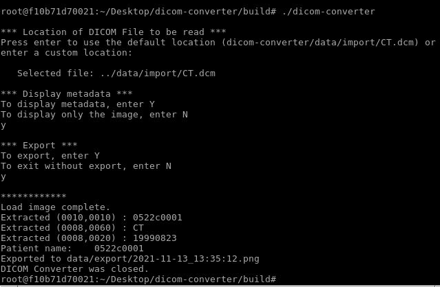

# DicomConverter - a simple converter that let's you view & save your favourite medical images! 

The **DICOM (Digital Imaging and Communications in Medicine)** standard serves to save, send and retrieve medical image data in a standardized way. Use this DICOM converter to:

  
 

 
* Read a DICOM file (.dcm)
* Display the image (e.g. CT, MRT) (_currently, only monochrome images are supported_)
* Display meta information such as patient name, study data, or modality (optional)
* Export image as .png (optional)

  

Define your own input file, decide whether you want to include metadata and whether you want to export your image:

  

Follow the instructions on the command line and view the DICOM image in a pop-up window. The file will then optionally be exported when closing the window. 

_Note: This project was developed as final capstone project in the [Udacity C++ Nanodegree Program](https://www.udacity.com/course/c-plus-plus-nanodegree--nd213)._

## Dependencies for Running Locally

* cmake >= 3.7
  * All OSes: [click here for installation instructions](https://cmake.org/install/)
* make >= 4.1 (Linux, Mac), 3.81 (Windows)
  * Linux: make is installed by default on most Linux distros
  * Mac: [install Xcode command line tools to get make](https://developer.apple.com/xcode/features/)
  * Windows: [Click here for installation instructions](http://gnuwin32.sourceforge.net/packages/make.htm)
* gcc/g++ >= 5.4
  * Linux: gcc / g++ is installed by default on most Linux distros
  * Mac: same deal as make - [install Xcode command line tools](https://developer.apple.com/xcode/features/)
  * Windows: recommend using [MinGW](http://www.mingw.org/)
* dcmtk == 3.6.6 (DICOM Toolkit)
  * See build instructions below if not already installed
* SDL2 >= 2.0
  * All installation instructions can be found [here](https://wiki.libsdl.org/Installation)
  >Note that for Linux, an `apt` or `apt-get` installation is preferred to building from source. 
* SDL_ttf
  * All installation instructions can be found [here](https://www.libsdl.org/projects/SDL_ttf/)
  * On Linux, use `sudo apt-get install libsdl2-ttf-dev`
  
## Build DCMTIK - DICOM Toolkit 

1. Download `dcmtk` from  [DCMTK - DICOM Toolkit](https://dicom.offis.de/dcmtk.php.en)

2. Extract the files to your workspace folder

3. Build `dcmtk` in your workspace folder 
* `mkdir dcmtk-3.6.6-build`
* `cd dcmtk-3.6.6-build`
* `cmake ..`
* `make DESTDIR=../dcmtk-3.6.6-install install`

3. Alternatively, use the install script:
* Open a bash terminal
* `chmod +x /home/workspace/dicom-converter/install-dcmtk.sh`
* `./home/workspcae/dicom-converter/install-dcmtk.sh`

4. Ensure that the `DCMDICTPATH` environment variable is set correctly (points to `.../dcmdata/data/dicom.dic` file). 

## Build this project

1. Clone this repo from [github.com/carlasailer/dicom-converter](https://github.com/carlasailer/dicom-converter).
2. Make a build directory in the top level directory: `mkdir build && cd build`
3. Compile: `cmake .. && make`
4. Run it: `./dicomConverter`.

## File and Class structure
* `src/`  
  * `./main.cpp` 
  * `./dicomreader.h` & `./dicomreader.cpp`:      `namespace DicomReader`   
  * `./dicomobject.h` & `./dicomobject.cpp`:      `class DicomObject`  
  * `./controller.h` & `.controller.cpp`:         `class Controller`
  * `./renderer.h` & `./renderer.cpp`:            `class Renderer`  
  * `./userinput.h` & `./userinput.cpp`:          `class UserInput`  
* `utils/`  
  * `.FindSLD2.cmake`: needed for CMAKE to find the correct location of installed SDL2
  * `.FindSDL2.cmake`: needed for CMAKE to find the correct location of installed SDL2-ttf
  * `arial.ttf`: font used to render text on the image
* `data/` 
  * `./export/`: target folder for saved images
  * `./import/`: example data provided for testing purposes

## Submission as part of the C++ Nanodegree
The following rubric points were implemented in this project:

**Loops, Functions, I/O**
* _The project demonstrates an understanding of C++ functions and control structures._
  * use of conditional control structures, e.g. in `UserInput::User_getDisplayMetaData` (in `src/userinput.cpp`, lines 22-45)
  * modular organization in functions, e.g. in `convertTimeStampToString` and `getFilenameWithTimestamp` (`renderer.cpp`, lines 7-32)
* _The project reads data from a file and process the data, or the program writes data to a file._
  * read contents of `.dcm` file: `namespace DicomReader` (in `src/dicomreader.cpp`, lines 11-67)
* _The project accepts user input and processes the input._: 
  * implemented in `class UserInput` in `src/userinput.cpp`

**Object Oriented Programming**
* _The project uses Object Oriented Programming techniques._
  * implementation of classes `class UserInput` (in `src/userinput.h`, lines 6-27), `class DicomObject` (in `src/dicomobject.h`, lines 10-32) and `class Renderer` (in `src/renderer.h`, lines 10-33)
* _Classes use appropriate access specifiers for class members._
  * public and private member variables of `class UserInput` (in `src/userinput.h`, lines 8-25)
* _Classes encapsulate behavior._
  * implementation of classes `class UserInput` (in `src/userinput.h`, lines 6-27), `class DicomObject` (in `src/dicomobject.h`, lines 10-32) and `class Renderer` (in `src/renderer.h`, lines 10-33)

**Memory Management**
* _The project makes use of references in function declarations._
  * Two functions use pass-by-reference: `DicomObject::renderImage` and `DicomReader::getPixelData`
* _The project follows the Rule of 5._
  * implemented for `class Renderer` in `src/renderer.h`
* _The project uses move semantics to move data, instead of copying it, where possible._ 
  * use of move constructor in `src/main.cpp` line 31
